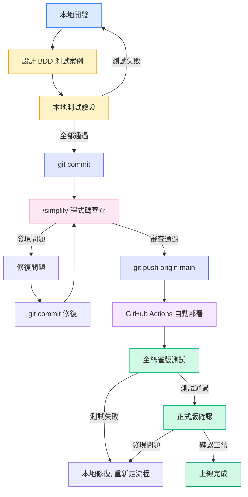
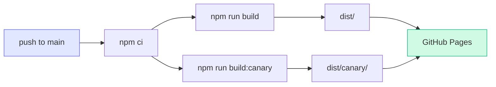
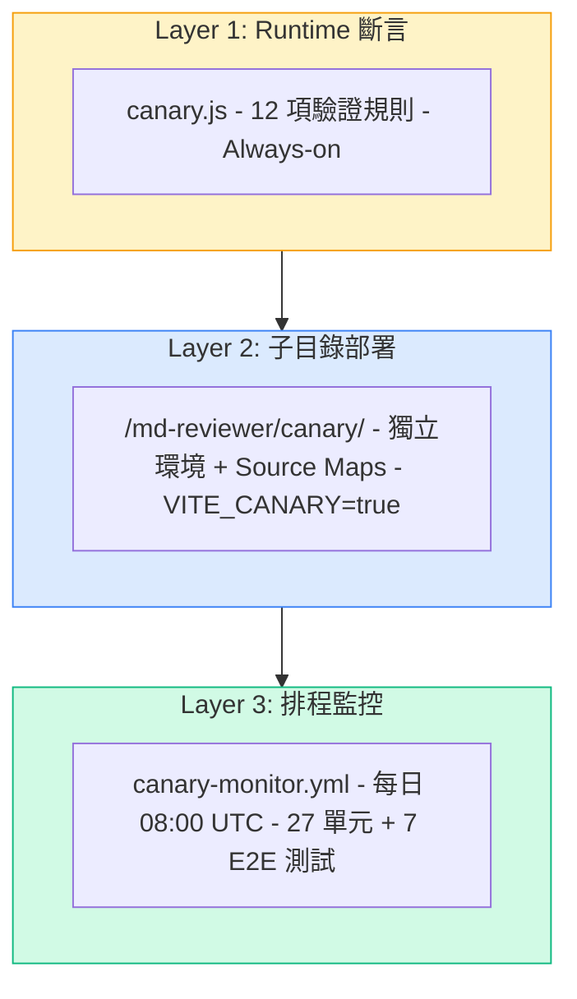
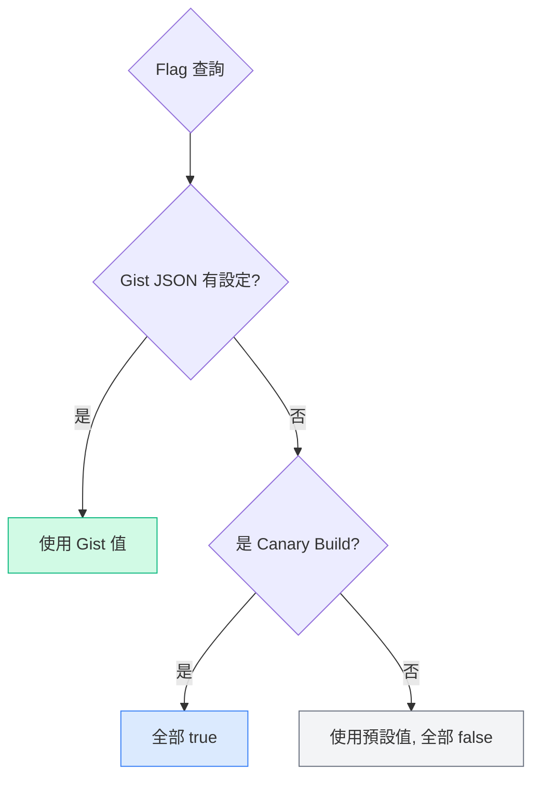
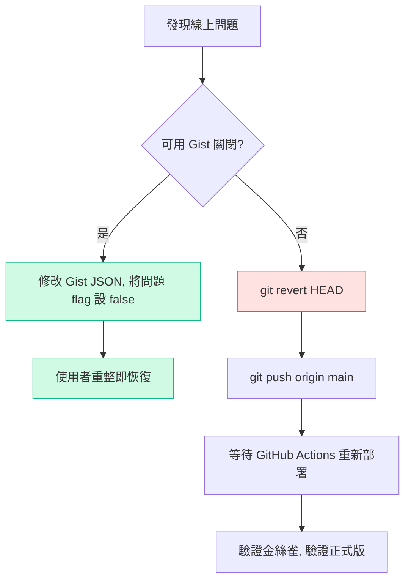

# MD Reviewer 開發上線指引

## 總覽流程圖



---

## 各階段詳細說明

### 1. 本地開發

```bash
npm run dev          # 啟動 Vite dev server (http://localhost:5173/md-reviewer/)
```

- 修改 `src/` 下的檔案，HMR 即時更新
- 主要檔案：`src/MdReviewer.jsx`（主元件）、`src/diffWorker.js`（diff 引擎）
- 新功能需先在 `src/featureFlags.js` 註冊 flag（預設 `false`）

### 2. BDD 測試設計

在開發前或開發中，針對功能設計多情境測試案例：

| 分類 | 範例情境 |
|------|----------|
| 正常路徑 | 載入檔案 → 顯示正確 → 編輯 → 儲存 → 重新渲染 |
| 邊界條件 | 空內容、超長文字、特殊字元、大量檔案 |
| 錯誤處理 | 無效語法、網路中斷、非預期輸入 |
| 互動流程 | 切換檔案、連續編輯、快速操作 |
| 視覺驗證 | 樣式正確、RWD、Dark mode |

測試資料放在 `test-data/` 目錄，JSON 格式：
```json
{
  "version": 1,
  "files": [
    { "name": "test.md", "content": "...", "originalContent": "...", "marks": [], "status": "pending" }
  ]
}
```

### 3. 本地測試驗證

依 BDD 案例逐一驗證，可使用：
- **手動測試**：在瀏覽器上操作 dev server
- **Playwright MCP**：自動化瀏覽器測試（截圖存 `screenshots/`）
- **單元測試**：`npm run test:engine`（27+ 項 diff 引擎驗證）

所有案例通過後才進入下一步。

### 4. Commit

```bash
git add <specific-files>    # 加入變更檔案（避免 git add -A）
git commit -m "描述性訊息"
```

注意事項：
- 不要提交 `.env`、credentials、大型二進位檔案
- Commit message 描述「為什麼」而非「做了什麼」
- 截圖檔案已在 `.gitignore`，不會被提交

### 5. 程式碼審查（/simplify）

Commit 之後、Push 之前，執行 `/simplify`：

```
/simplify
```

這會觸發三個平行審查：
1. **Code Reuse** — 搜尋現有工具函式，避免重複造輪子
2. **Code Quality** — 檢查冗餘狀態、copy-paste、抽象洩漏
3. **Efficiency** — 檢查不必要計算、記憶體洩漏、熱路徑膨脹

審查結果按嚴重度分類：
- **High**：必須修復
- **Medium**：建議修復
- **Low**：可選擇跳過（需記錄原因）

### 6. 修復問題 → 再 Commit

```bash
# 修復後建立新 commit（不要 amend 前一個 commit）
git add <fixed-files>
git commit -m "Simplify: 修復描述"
```

重複執行 `/simplify` 直到通過。

### 7. Push

```bash
git push origin main
```

Push 後 GitHub Actions 自動觸發部署。

### 8. GitHub Actions 自動部署

部署流程（`.github/workflows/deploy.yml`）：



- **正式版**：`https://NickHuangbeauty.github.io/md-reviewer/`
- **金絲雀**：`https://NickHuangbeauty.github.io/md-reviewer/canary/`
- 兩版在同一次 Action 中同時建構部署
- 金絲雀版啟用 source maps + `VITE_CANARY=true` + commit SHA 標記

### 9. 金絲雀測試（Canary-First 原則）

> **最高指導原則**：任何功能必須先在金絲雀版確認通過，絕對不可跳過。

測試順序：
1. 開啟 `https://NickHuangbeauty.github.io/md-reviewer/canary/`
2. 確認頂部顯示 `CANARY BUILD <commit-sha>`（版本正確）
3. 依 BDD 案例逐一驗證功能
4. 檢查 Console 零 error
5. 全部通過 → 進入正式版確認

### 10. 正式版確認

1. 開啟 `https://NickHuangbeauty.github.io/md-reviewer/`
2. 抽樣驗證關鍵功能
3. 確認 Console 零 error
4. 確認 Feature Flag 控制正常（新功能在正式版應為關閉狀態）

---

## 三層金絲雀架構



| 層級 | 檔案 | 說明 |
|------|------|------|
| Layer 1 | `src/canary.js` | 12 項 runtime 驗證，catch 損壞的 diff 資料 |
| Layer 2 | `vite.config.canary.js` | 獨立 `/canary/` 子目錄，含 source maps |
| Layer 3 | `tests/` + `.github/workflows/canary-monitor.yml` | 27 單元測試 + 7 E2E 煙霧測試，每日排程 |

---

## Feature Flag 系統

### 優先序



**優先序**：Gist JSON（最高）> Canary（全開）> 預設值（全關）

### Gist JSON 設定

**URL**：`https://gist.githubusercontent.com/NickHuangbeauty/6967bfb280d66b769dc41d4c9a5f81c5/raw/md-reviewer-flags.json`

**格式**：
```json
{
  "new-diff-engine": true,
  "dark-mode": true,
  "dashboard": false,
  "diff-fold": false
}
```

**行為**：
- 每次 session 載入時 fetch 一次（`cache: 'no-cache'`）
- 網路失敗時靜默 fallback 到預設值
- 修改 Gist → 使用者重新整理頁面即生效

### 使用場景

| 場景 | 做法 |
|------|------|
| **漸進式上線** | Gist 中逐一開啟 flag，觀察回報 |
| **緊急關閉功能** | Gist 中將問題 flag 設為 `false`，使用者重整即關閉 |
| **金絲雀獨享測試** | 不設定 Gist → Canary 自動全開，正式版全關 |
| **正式版選擇性開啟** | Gist 中只開特定 flag，覆蓋 Canary 預設 |

### 新增 Flag 步驟

1. `src/featureFlags.js` — `FLAG_DEFAULTS` 加入新 key（預設 `false`）
2. 元件中使用 `useFeatureFlag('flag-name')` 讀取
3. Worker 中透過 `getAllFlags()` 傳入
4. 部署後在 Gist JSON 加入新 key 控制

---

## 緊急回滾流程



**優先用 Gist 回滾**（秒級生效），git revert 是最後手段（需等 CI/CD）。

---

## 常用指令速查表

| 指令 | 說明 |
|------|------|
| `npm run dev` | 啟動本地 dev server |
| `npm run build` | 建構正式版 |
| `npm run build:canary` | 建構金絲雀版 |
| `npm run test:engine` | 執行 diff 引擎單元測試（27 項） |
| `npm run test:smoke` | 執行 Playwright E2E 煙霧測試（7 項） |
| `npm run test:all` | 執行所有測試 |
| `/simplify` | Claude Code 程式碼審查 |
| `git push origin main` | 推送並觸發自動部署 |

---

## 檔案結構速查

```
src/
├── MdReviewer.jsx      # 主元件（~3500 行）
├── diffWorker.js       # Web Worker diff 引擎
├── featureFlags.js     # Feature Flag 系統
├── canary.js           # Runtime 斷言驗證器
├── main.jsx            # 進入點
└── index.css           # Tailwind + Dark mode CSS

tests/
├── diff-engine.test.mjs  # 單元測試（27 項）
└── smoke.mjs             # E2E 煙霧測試（7 項）

test-data/              # BDD 測試用 JSON
.github/workflows/
├── deploy.yml          # 自動部署（push to main）
└── canary-monitor.yml  # 每日健康檢查
```
