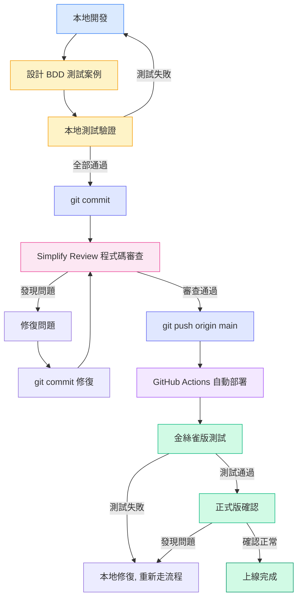
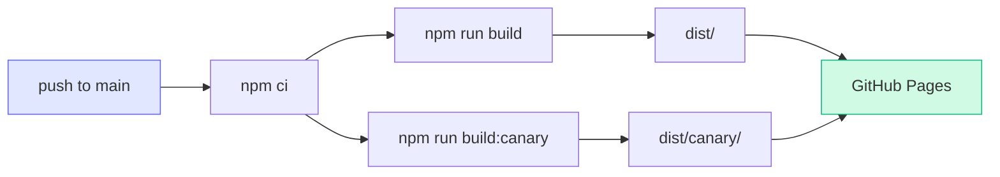
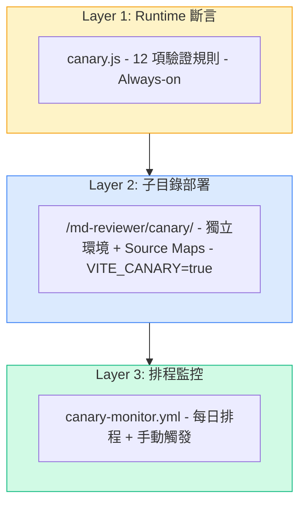
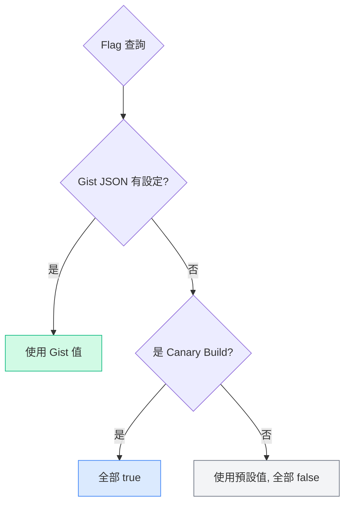
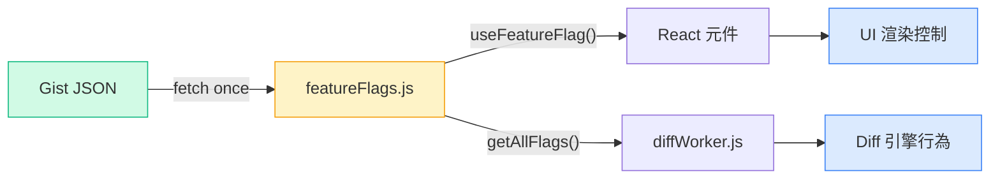
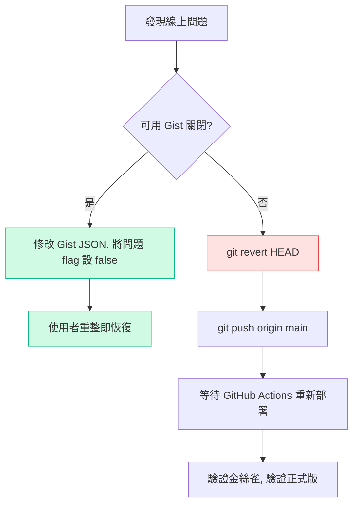

# MD Reviewer 開發上線指引

## 總覽流程圖



---

## 各階段詳細說明

### 1. 本地開發

```bash
npm run dev          # 啟動 Vite dev server (http://localhost:5173/md-reviewer/)
```

- 修改 `src/` 下的檔案，HMR 即時更新
- 主要檔案：`src/MdReviewer.jsx`（主元件）、`src/diffWorker.js`（diff 引擎）
- 新功能需先在 `src/featureFlags.js` 註冊 flag（預設 `false`）

### 2. BDD 測試設計

在開發前或開發中，針對功能設計多情境測試案例：

| 分類 | 範例情境 |
|------|----------|
| 正常路徑 | 載入檔案 → 顯示正確 → 編輯 → 儲存 → 重新渲染 |
| 邊界條件 | 空內容、超長文字、特殊字元、大量檔案 |
| 錯誤處理 | 無效語法、網路中斷、非預期輸入 |
| 互動流程 | 切換檔案、連續編輯、快速操作 |
| 視覺驗證 | 樣式正確、RWD、Dark mode |

測試資料放在 `test-data/` 目錄，JSON 格式：
```json
{
  "version": 1,
  "files": [
    { "name": "test.md", "content": "...", "originalContent": "...", "marks": [], "status": "pending" }
  ]
}
```

### 3. 本地測試驗證

依 BDD 案例逐一驗證，可使用：
- **手動測試**：在瀏覽器上操作 dev server
- **Playwright MCP**：自動化瀏覽器測試（截圖存 `screenshots/`）
- **單元測試**：`npm run test:engine`（27+ 項 diff 引擎驗證）

所有案例通過後才進入下一步。

### 4. Commit

```bash
git add <specific-files>    # 加入變更檔案（避免 git add -A）
git commit -m "描述性訊息"
```

注意事項：
- 不要提交 `.env`、credentials、大型二進位檔案
- Commit message 描述「為什麼」而非「做了什麼」
- 截圖檔案已在 `.gitignore`，不會被提交

### 5. 程式碼審查（Simplify Review）

Commit 之後、Push 之前，必須完成 **Simplify Review**（工具不限）。

審查必須涵蓋三個面向：
1. **Code Reuse** — 搜尋現有工具函式，避免重複造輪子
2. **Code Quality** — 檢查冗餘狀態、copy-paste、抽象洩漏
3. **Efficiency** — 檢查不必要計算、記憶體洩漏、熱路徑膨脹

各工具建議入口：
- **Claude Code**：可直接使用 `/simplify`
- **Gemini / OpenAI Codex**：使用同一份 Simplify Review 檢查清單，輸出相同格式（嚴重度 + 檔案/行號 + 修復建議）

審查結果按嚴重度分類：
- **High**：必須修復
- **Medium**：建議修復
- **Low**：可選擇跳過（需記錄原因）

### 6. 修復問題 → 再 Commit

```bash
# 修復後建立新 commit（不要 amend 前一個 commit）
git add <fixed-files>
git commit -m "Simplify Review: 修復描述"
```

重複執行 Simplify Review 直到通過。

### 7. Push

```bash
git push origin main
```

Push 後 GitHub Actions 自動觸發部署。

### 8. GitHub Actions 自動部署

部署流程（`.github/workflows/deploy.yml`）：



- **正式版**：`https://NickHuangbeauty.github.io/md-reviewer/`
- **金絲雀**：`https://NickHuangbeauty.github.io/md-reviewer/canary/`
- 兩版在同一次 Action 中同時建構部署
- 金絲雀版啟用 source maps + `VITE_CANARY=true` + commit SHA 標記

### 9. 金絲雀測試（Canary-First 原則）

> **最高指導原則**：任何功能必須先在金絲雀版確認通過，絕對不可跳過。

測試順序：
1. 開啟 `https://NickHuangbeauty.github.io/md-reviewer/canary/`
2. 確認頂部顯示 `CANARY BUILD <commit-sha>`（版本正確）
3. 依 BDD 案例逐一驗證功能
4. 檢查 Console 零 error
5. 全部通過 → 進入正式版確認

### 10. 正式版確認

1. 開啟 `https://NickHuangbeauty.github.io/md-reviewer/`
2. 抽樣驗證關鍵功能
3. 確認 Console 零 error
4. 確認 Feature Flag 控制正常（新功能在正式版應為關閉狀態）

---

## 三層金絲雀架構

**目的**：三層架構形成多重防護網 — Layer 1 在每次使用者操作時即時攔截資料損壞，Layer 2 提供獨立環境讓新功能在不影響正式版的前提下被驗證，Layer 3 定期對線上版本做全面健康檢查，確保沒有靜默退化。



### Layer 1：Runtime 斷言（Always-on）

| 項目 | 說明 |
|------|------|
| **檔案** | `src/canary.js` |
| **觸發時機** | 每次 diff 計算完成時，由 `diffWorker.js` 自動呼叫 |
| **涵蓋範圍** | 正式版 + 金絲雀版（Always-on，不受 Feature Flag 控制） |
| **效能影響** | O(n) 單次遍歷，相對於 diff 的 O(n×m) 可忽略不計 |

**驗證規則（12 項）**：

`validateEdits(edits)` — 驗證 diff 產出的 edit 陣列：
1. edits 必須是陣列（`EDITS_NOT_ARRAY`）
2. 每個 edit 的 type 必須是 `add`/`del`/`modify`/`eq` 之一（`INVALID_EDIT_TYPE`）
3. `add` 必須有 `newLine`（`ADD_MISSING_FIELDS`）
4. `del` 必須有 `oldLine`（`DEL_MISSING_FIELDS`）
5. `modify` 必須同時有 `oldLine` 和 `newLine`（`MODIFY_MISSING_FIELDS`）
6. `eq` 必須同時有 `oldLine` 和 `newLine`（`EQ_MISSING_FIELDS`）
7. `oldIdx` 不得重複（`DUP_OLD_IDX`）
8. `newIdx` 不得重複（`DUP_NEW_IDX`）
9. 異常偵測：全部 edit 都是 modify 且平均相似度 < 0.3 → 警告配對可能失敗（`ALL_MODIFIED_LOW_SIM`）

`validateStats(stats, edits)` — 驗證統計數據：
10. added + deleted + modified + unchanged 必須等於 edits.length（`COUNT_MISMATCH`）
11. changeRatio 必須是 [0, 1.0] 的有效數字（`RATIO_NAN` / `RATIO_OUT_OF_RANGE`）
12. 異常偵測：changeRatio > 0.8 但 added=0 且 deleted=0 → 警告可能誤判（`HIGH_RATIO_NO_ADD_DEL`）

**運作方式**：`diffWorker.js` 在每次計算完成後呼叫 `validateEdits` 和 `validateStats`，若發現 violation 會在 Console 輸出 `[Canary]` 警告，並透過 `postMessage` 將報告傳回主執行緒。

### Layer 2：子目錄部署（獨立環境）

| 項目 | 說明 |
|------|------|
| **設定檔** | `vite.config.canary.js` |
| **部署路徑** | `https://NickHuangbeauty.github.io/md-reviewer/canary/` |
| **建構指令** | `npm run build:canary` |
| **環境變數** | `VITE_CANARY=true`（編譯時注入）、`GITHUB_SHA`（commit 標記） |

**與正式版的差異**：
- 所有 Feature Flag 預設全開（除非 Gist JSON 覆寫）
- 包含 source maps（方便除錯）
- 頂部顯示 `CANARY BUILD <commit-sha>` 標記
- 與正式版共用同一次 GitHub Actions，同時建構部署

**目的**：提供一個與正式版完全隔離的環境，讓開發者和測試者在不影響使用者的情況下，驗證新功能、Feature Flag 組合、以及 diff 引擎變更。

### Layer 3：排程監控（CI 自動化測試）

| 項目 | 說明 |
|------|------|
| **Workflow** | `.github/workflows/canary-monitor.yml` |
| **排程** | 每日 08:00 UTC（台灣時間 16:00），`cron: '0 8 * * *'` |
| **手動觸發** | 支援 `workflow_dispatch`，可指定自訂 `target_url` |
| **測試範圍** | 3 個 Job 平行執行 |

**三個平行 Job**：

| Job | 說明 | timeout |
|-----|------|---------|
| `engine-test` | 執行 `tests/diff-engine.test.mjs`（27 項 diff 引擎單元測試） | 5 分鐘 |
| `smoke-production` | Playwright 測試正式版 URL（7 項 E2E 煙霧測試） | 10 分鐘 |
| `smoke-canary` | Playwright 測試金絲雀版 URL（7 項 E2E 煙霧測試） | 10 分鐘 |

**目的**：即使沒有新的部署，也能每日自動偵測「靜默退化」— 例如外部 CDN 異常、GitHub Pages 部署損壞、或 Gist JSON 誤改導致功能異常。失敗時會自動上傳截圖至 GitHub Actions Artifacts（保留 7 天）。

> **注意**：GitHub 對於無活動的 repository，會在 60 天後自動停用 cron schedule。如果 repo 長期無 push，排程可能被暫停，需手動到 Actions 頁面重新啟用或做一次 push。

---

## Feature Flag 系統

### 優先序



**優先序**：Gist JSON（最高）> Canary（全開）> 預設值（全關）

### Gist JSON 設定

**URL**：`https://gist.githubusercontent.com/NickHuangbeauty/6967bfb280d66b769dc41d4c9a5f81c5/raw/md-reviewer-flags.json`

**格式**：
```json
{
  "new-diff-engine": true,
  "dark-mode": true,
  "dashboard": false,
  "diff-fold": false
}
```

**行為**：
- 每次 session 載入時 fetch 一次（`cache: 'no-cache'`）
- 網路失敗時靜默 fallback 到預設值
- 修改 Gist → 使用者重新整理頁面即生效

### Gist JSON 與程式碼的連動機制

Gist JSON 不只是一份設定檔，它透過 `src/featureFlags.js` 與整個應用形成即時連動關係：



**載入流程**：

1. 使用者開啟頁面 → `MdReviewer.jsx` mount 時呼叫 `fetchRemoteFlags()`
2. `featureFlags.js` 對 Gist URL 發送 `fetch(..., { cache: 'no-cache' })` 請求
3. 回傳 JSON 儲存到模組內部的 `_remoteFlags` 變數
4. 觸發 `notifyListeners()` → 所有使用 `useFeatureFlag()` 的 React 元件自動 re-render
5. 後續 diff 計算時，Worker 透過 `getAllFlags()` 取得最新 flag 值

**兩條控制路徑**：

| 路徑 | 機制 | 影響範圍 |
|------|------|----------|
| **UI 控制** | `useFeatureFlag('flag-name')` React Hook | 控制元件是否渲染，例如 `dark-mode` 決定是否顯示主題切換按鈕，`dashboard` 決定是否顯示差異儀表板 |
| **Worker 控制** | `getAllFlags()` 透過 `postMessage` 傳入 Worker | 控制 diff 引擎行為，例如 `new-diff-engine` 決定使用新版或舊版演算法 |

**Gist 覆寫範例**：

| Gist 設定 | 金絲雀版行為 | 正式版行為 |
|-----------|-------------|-----------|
| 未設定任何 key | 全部功能開啟 | 全部功能關閉 |
| `"dark-mode": true` | dark-mode 開啟（由 Gist 控制） | dark-mode 開啟（由 Gist 控制） |
| `"dark-mode": false` | dark-mode **關閉**（Gist 覆寫 Canary 預設） | dark-mode 關閉 |
| `"new-diff-engine": true, "dark-mode": false` | 新引擎開、暗色關 | 新引擎開、暗色關 |

> **重點**：Gist JSON 的覆寫是「逐 key」的。未出現在 Gist 中的 key 仍照 Canary/Defaults 邏輯走。這讓你可以只控制特定功能而不影響其他。

**網路失敗的安全機制**：
- `fetchRemoteFlags()` 使用 `.catch(() => {})` 靜默處理錯誤
- fetch 失敗 → `_remoteFlags` 維持 `null` → `getFlag()` 跳過 Gist 層 → 回退到 Canary/Defaults
- 不會因為 Gist 不可用而讓應用崩潰或產生非預期行為

### 使用場景

| 場景 | 做法 |
|------|------|
| **漸進式上線** | Gist 中逐一開啟 flag，觀察回報 |
| **緊急關閉功能** | Gist 中將問題 flag 設為 `false`，使用者重整即關閉 |
| **金絲雀獨享測試** | 不設定 Gist → Canary 自動全開，正式版全關 |
| **正式版選擇性開啟** | Gist 中只開特定 flag，覆蓋 Canary 預設 |
| **強制關閉金絲雀功能** | Gist 中將特定 flag 設 `false` → 連金絲雀也會關閉（用於緊急停用） |

### 新增 Flag 步驟

1. `src/featureFlags.js` — `FLAG_DEFAULTS` 加入新 key（預設 `false`）
2. 元件中使用 `useFeatureFlag('flag-name')` 讀取
3. Worker 中透過 `getAllFlags()` 傳入
4. 部署後在 Gist JSON 加入新 key 控制

---

## 緊急回滾流程



**優先用 Gist 回滾**（秒級生效），git revert 是最後手段（需等 CI/CD）。

---

## 常用指令速查表

| 指令 | 說明 |
|------|------|
| `npm run dev` | 啟動本地 dev server |
| `npm run build` | 建構正式版 |
| `npm run build:canary` | 建構金絲雀版 |
| `npm run test:engine` | 執行 diff 引擎單元測試（27 項） |
| `npm run test:smoke` | 執行 Playwright E2E 煙霧測試（7 項） |
| `npm run test:all` | 執行所有測試 |
| `Simplify Review` | 必經審查 Gate（Claude 可用 `/simplify`） |
| `git push origin main` | 推送並觸發自動部署 |

---

## 檔案結構速查

```
src/
├── MdReviewer.jsx      # 主元件（~3500 行）
├── diffWorker.js       # Web Worker diff 引擎
├── featureFlags.js     # Feature Flag 系統
├── canary.js           # Runtime 斷言驗證器
├── main.jsx            # 進入點
└── index.css           # Tailwind + Dark mode CSS

tests/
├── diff-engine.test.mjs  # 單元測試（27 項）
└── smoke.mjs             # E2E 煙霧測試（7 項）

test-data/              # BDD 測試用 JSON
.github/workflows/
├── deploy.yml          # 自動部署（push to main）
└── canary-monitor.yml  # 每日健康檢查
```
