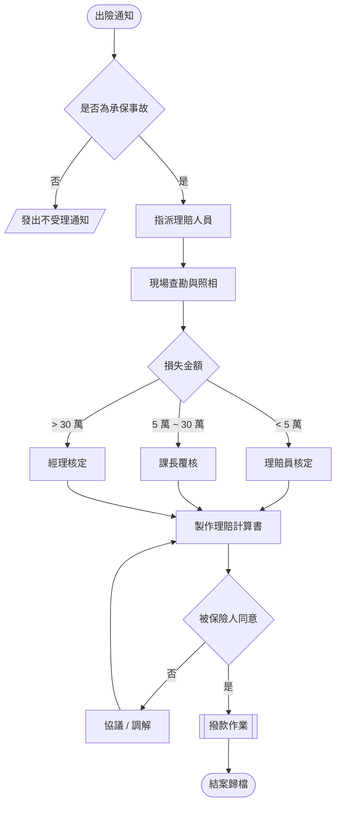

# 車險理賠作業流程

## 一、流程總覽

## 二、時效規定

|||

| 階段 | 法定時效 | 內部目標 | 逾期處理 |
| --- | --- | --- | --- |
| 受理登錄 | 當日 | 2 小時內 | 系統自動示警 |
| 現場查勘 | 3 個工作日 | 1 個工作日 | 通報課長 |
| 理賠給付 | 收齊文件後 15 日 | 10 日 | 加計利息 |

## 三、注意事項

被保險人應於知悉事故後五日內通知本公司，但因不可抗力致不能於期限內通知者，不在此限。逾期未通知且致本公司受有損害者，本公司得就其