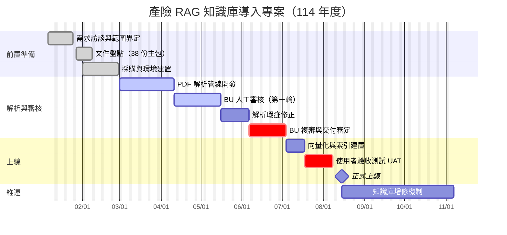

# 產險 RAG 知識庫導入時程

## 專案甘特圖

## 關鍵里程碑

| 里程碑 | 預定日期 | 實際日期 | 狀態 |
| --- | --- | --- | --- |
| 文件盤點完成 | 2025/01/31 | 2025/02/03 | ✅ 完成（延誤 3 天） |
| 解析管線可用 | 2025/03/31 | — | 🔄 進行中 |
| 第一輪審核完成 | 2025/04/25 | — | ⏳ 未開始 |
| 正式上線 | 2025/08/15 | — | ⏳ 未開始 |
