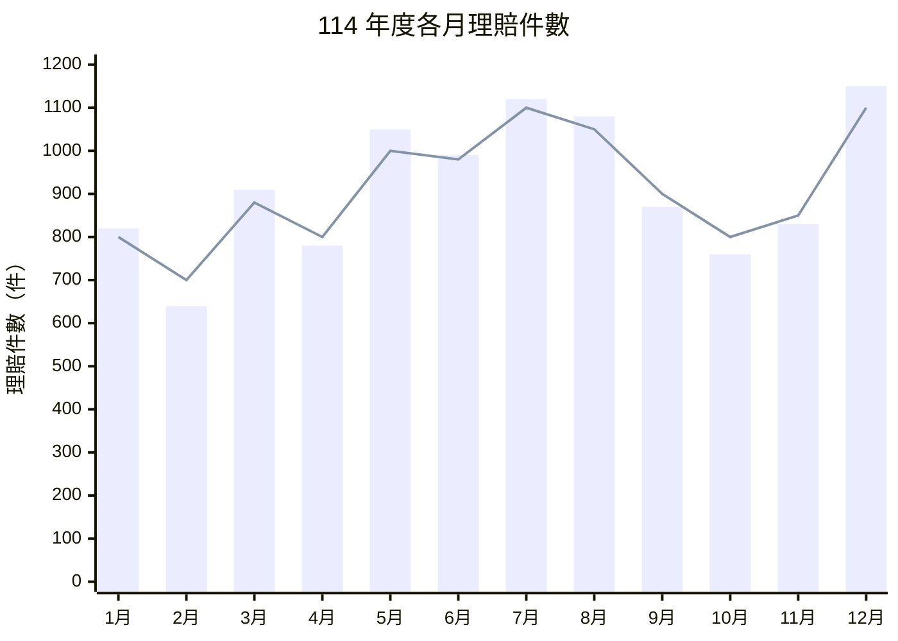
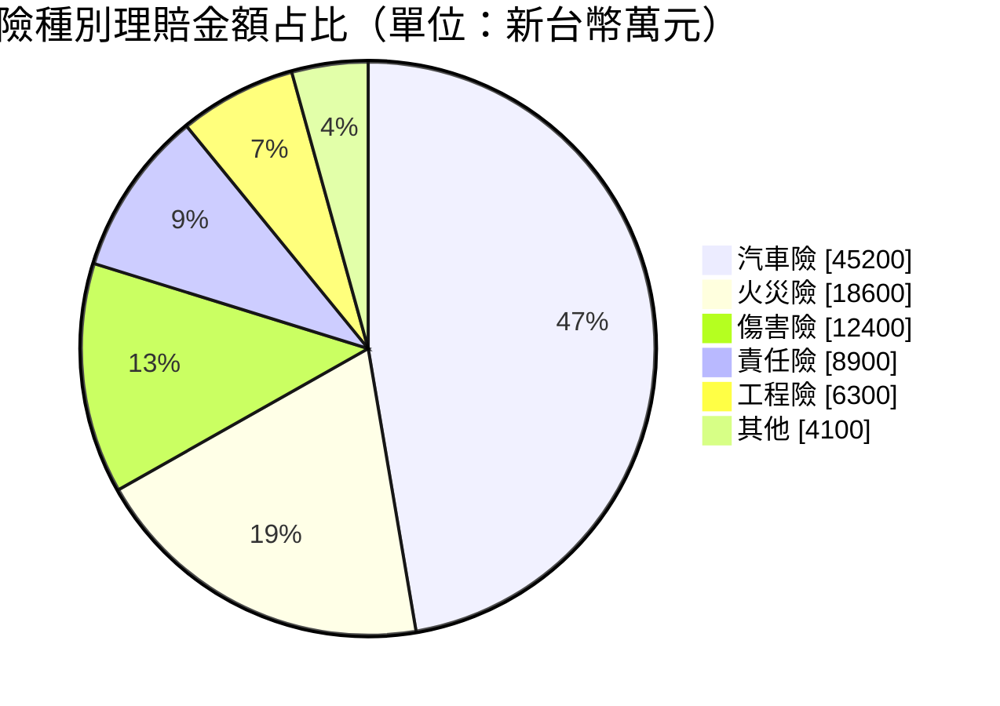

# 114 年度理賠統計分析

## 一、各月理賠件數與金額趨勢

## 二、險種別理賠金額占比

## 三、統計摘要

| 險種 | 理賠金額（萬元） | 占比 | 較去年增減 |
| --- | ---: | ---: | ---: |
| 汽車險 | 45,200 | 42.0% | +5.3% |
| 火災險 | 18,600 | 19.0% | −2.1% |
| 傷害險 | 12,400 | 12.6% | +8.7% |
| 責任險 | 8,900 | 9.1% | +1.2% |
| 工程險 | 6,300 | 6.4% | −11.4% |
| 其他 | 4,100 | 4.2% | +0.5% |
| **合計** | **95,500** | **100.0%** | **+2.8%** |

> 註：汽車險占比為全年度最高，約 **42%**。
