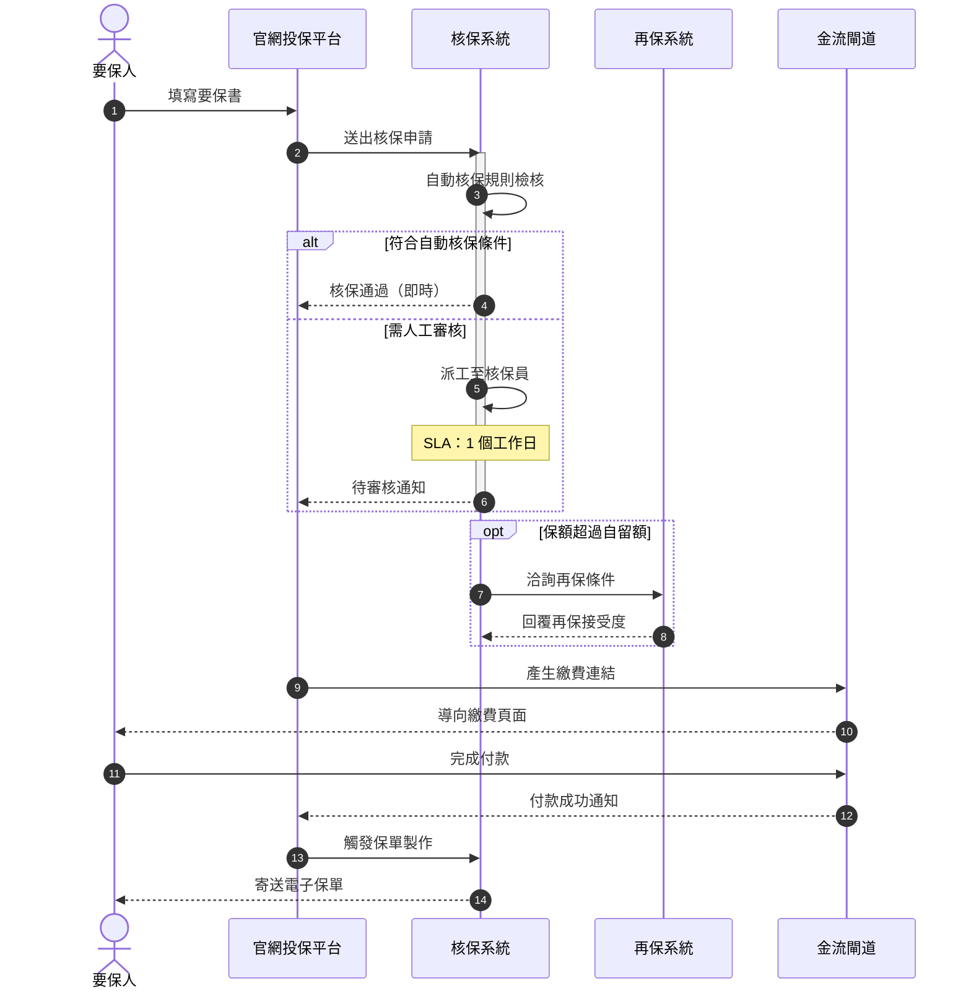

# 線上投保系統互動時序

## 系統間互動

第 12 頁 / 共 45 頁　　國泰產物保險股份有限公司　機密文件

## 服務水準（SLA）

| 環節 | 目標時間 | 監控方式 |
| --- | --- | --- |
| 自動核保回覆 | < 3 秒 | APM 監控 |
| 人工核保派工 | < 1 工作日 | 系統派工佇列 |
| 電子保單寄送 | 付款後 30 分鐘內 | 寄送成功率報表 |
