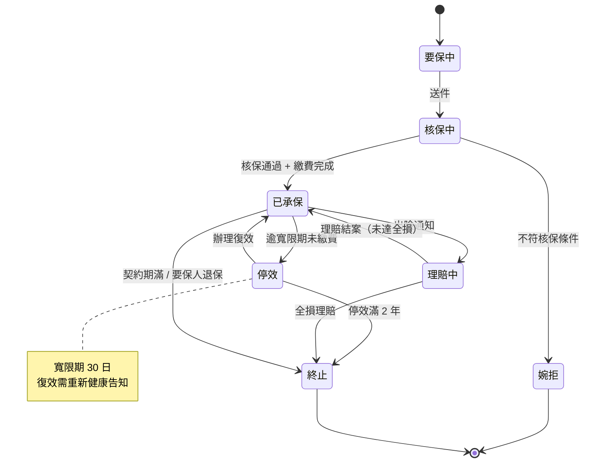

# 保單狀態流轉與費率計算

## 一、保單狀態機

## 二、保費計算公式

年度應繳保費依下式計算：

$$
P = \left( B \times R_{\text{base}} \times \prod_{i=1}^{n} F_i \right) \times (1 + \alpha) - D
$$

其中：

- $P$：應繳保費
- $B$：保險金額（Sum Insured）
- $R_{\text{base}}$：基本費率，火險甲式為 $0.15\%$
- $F_i$：第 $i$ 項調整因子（職業等級、地區、年齡…）
- $\alpha$：附加費用率，本公司為 $0.28$
- $D$：折扣金額（無理賠紀錄折扣最高 $30\%$）

### 範例

保額 $B = 10{,}000{,}000$、基本費率 $R_{base} = 0.0015$、調整因子乘積 $\prod F_i = 1.2$：

$$
P = (10{,}000{,}000 \times 0.0015 \times 1.2) \times 1.28 = 23{,}040
$$

無理賠折扣 15% 後，實繳 $23{,}040 \times 0.85 = 19{,}584$ 元。
