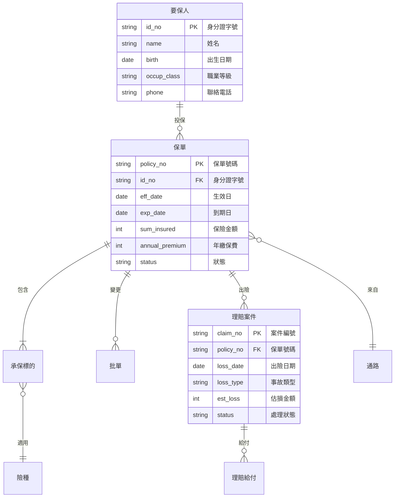

# 保單核心資料模型

## 一、實體關聯圖

## 二、關鍵欄位規格

| 欄位 | 型別 | 長度 | 必填 | 說明 |
| --- | --- | ---: | :---: | --- |
| 保單號碼 | VARCHAR | 16 | Y | 格式：`AA-YYYYMM-NNNNNN` |
| 身分證字號 | VARCHAR | 10 | Y | 需通過檢核碼驗證 |
| 生效日 | DATE | — | Y | 不得早於要保日 |
| 保險金額 | BIGINT | — | Y | 單位：新台幣元 |
| 狀態 | ENUM | — | Y | 要保中/核保中/已承保/停效/理賠中/終止 |
| 備註 | NVARCHAR | 500 | N | 自由文字，可能含全形字元 |

## 三、資料品質注意事項

歷史資料轉換時，部分早期保單的「職業等級」欄位存在編碼問題，顯示為 <20> 或 <20><20>，需由人工比對原始紙本補正。
