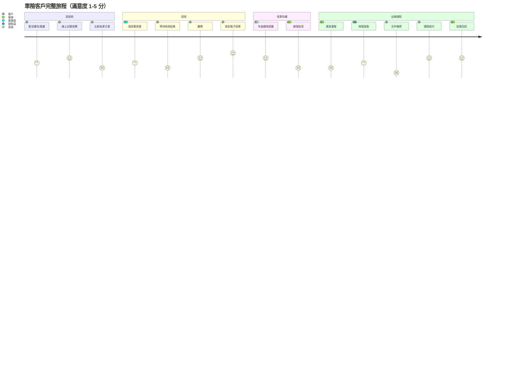
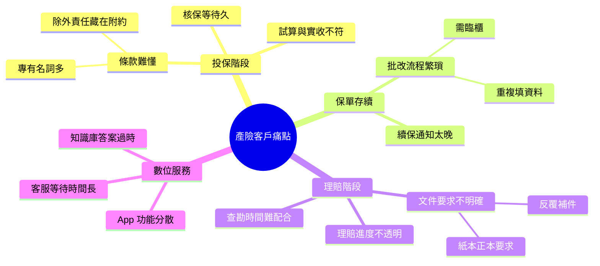

# 產險客戶體驗地圖

## 一、投保到理賠的客戶旅程

## 二、痛點盤整（心智圖）

## 三、改善優先序

| 痛點 | 影響人數 | 嚴重度 | 改善難度 | 優先序 |
| --- | ---: | :---: | :---: | :---: |
| 理賠反覆補件 | 高 | 高 | 中 | **P0** |
| 條款難懂 | 高 | 中 | 低 | **P0** |
| 批改需臨櫃 | 中 | 高 | 高 | P1 |
| 知識庫答案過時 | 中 | 中 | 低 | **P0** |
| 核保等待久 | 中 | 中 | 中 | P1 |
