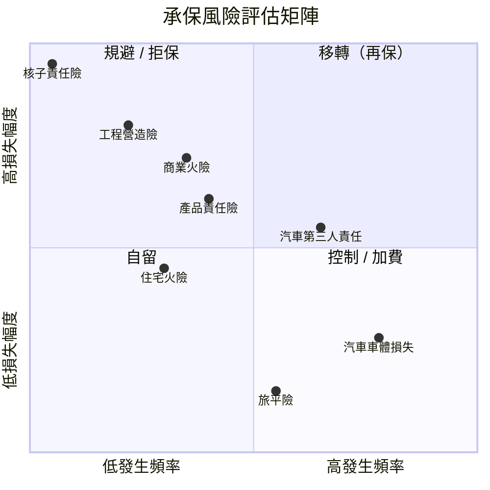
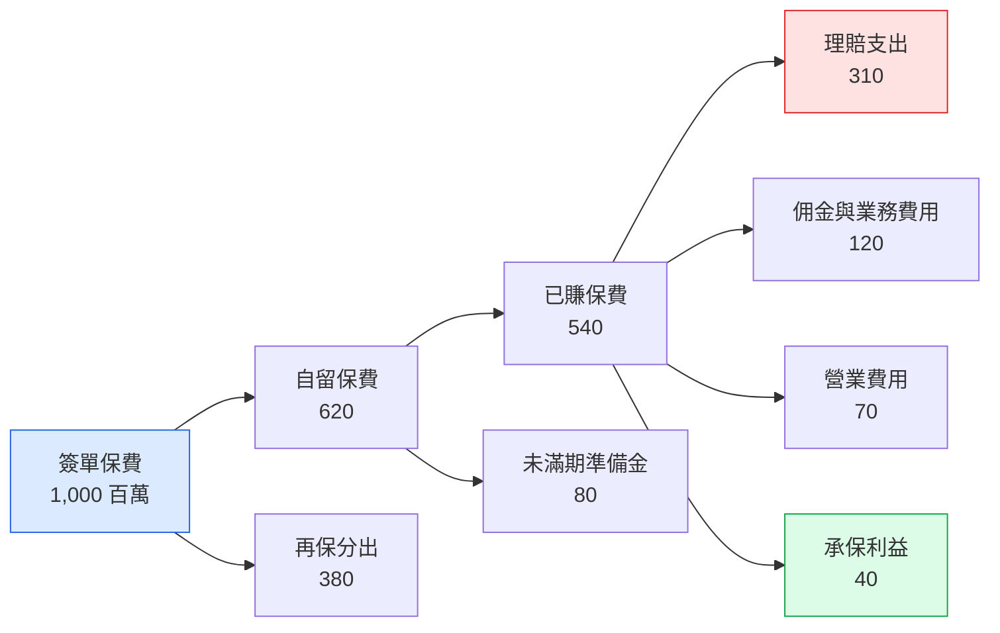

# 風險評估與保費資金流

## 一、風險四象限

## 二、保費資金流向

> 註：Mermaid 10.9.1 的 `sankey-beta` 不支援中文節點名，故以流程圖表達資金流。

| 項目 | 金額（百萬） | 占簽單保費 |
| --- | ---: | ---: |
| 簽單保費 | 1,000 | 100.0% |
| 減：再保分出 | (380) | 38.0% |
| 自留保費 | 620 | 62.0% |
| 已賺保費 | 540 | 54.0% |
| 減：理賠支出 | (310) | 31.0% |
| 減：佣金與費用 | (190) | 19.0% |
| **承保利益** | **40** | **4.0%** |

## 三、風險胃納量（Risk Appetite）

| 風險類別 | 自留上限（單一風險） | 年度累積上限 | 再保安排 |
| --- | ---: | ---: | --- |
| 住宅火險 | 3,000 萬 | 15 億 | 溢額再保 |
| 商業火險 | 8,000 萬 | 40 億 | 溢額 + 超額賠款 |
| 工程險 | 5,000 萬 | 25 億 | 臨分為主 |
| 汽車險 | 1,000 萬 | 60 億 | 超額賠款 |
| 特殊風險 | 不自留 | — | 100% 分出 |
